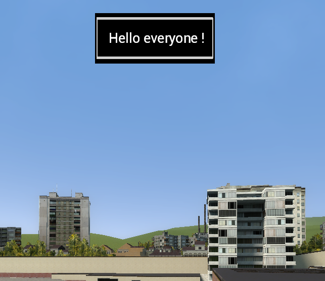

# Garry's Mod 📢 Advertisement 📢

A simple command that advertises to all players.

## How it works ? 

To do an advertisement, you have to be minimum __Admin__.

-The command is : /adv <message>

-The advertisement time duration is 10 secondes. 

-You have to enter a message with less than 43 characters

## Can i change the background or the timer ?

Yes, you can change it.

Time duration : <u>line code cl_init :</u>

```Lua
      --Advert time duration : 10 sec
      advertEndTime = CurTime() +10
```


Import your own background :<u> cl_init.lua :</u>

You have to enter the new background into : _"Advertise\materials\adv\you_bg.png"_
```Lua
  local backgroundAdv = Material("materials/adv/advert.png") 
```

## 📷 How it looks 




## 🚀 About Me

If you have any suggestion, you can write to me on my discord : 

.bou_bou_
